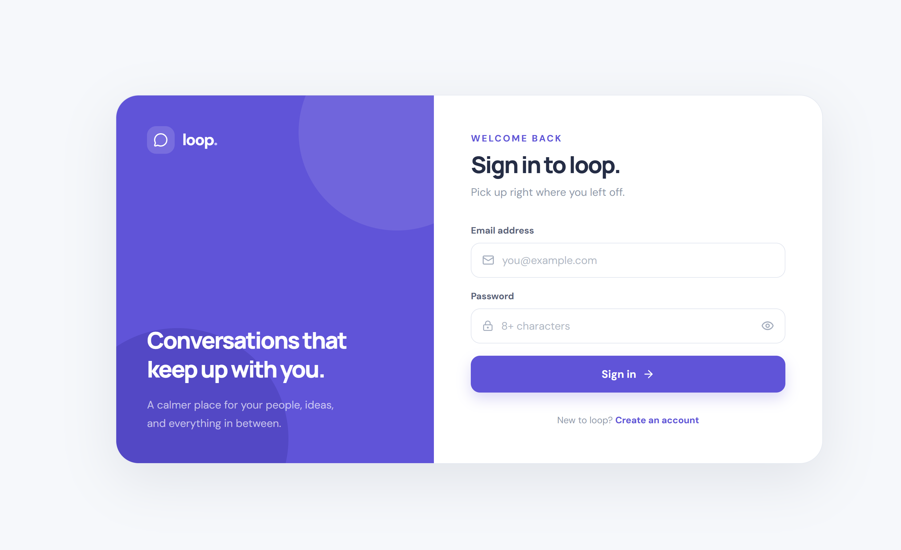
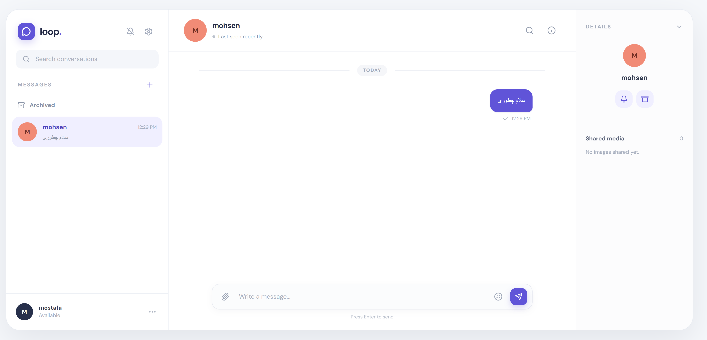

# loop — Real-Time Chat App

A full-stack real-time messaging application with a clean, calm interface. Users can sign up, start one-on-one conversations, exchange messages instantly over WebSockets, share images, and manage their conversations (mute, archive, search).

## Screenshots

### Sign in



### Chat workspace



## Features

- **Authentication** — register and sign in with email and password, with protected routes on the client
- **Real-time messaging** — instant delivery over WebSockets, with sent/read status on messages
- **Conversations list** — search conversations, see the latest message and time at a glance
- **Archive and mute** — archive conversations and mute notifications per chat
- **Image sharing** — attach images, preview them in a lightbox, and browse them in the *Shared media* panel
- **Presence** — online / last seen status
- **Details panel** — contact info and shared media next to the chat
- **Emoji picker** and Enter-to-send composer
- **RTL-friendly** — Persian / Arabic text renders correctly in messages
- **Deployment ready** — Docker, Nginx, and Netlify Functions configs included

## Tech Stack

**Frontend**
- React + TypeScript, built with Vite
- Tailwind CSS and shadcn/ui components
- Socket client for real-time events

**Backend**
- Node.js + Express + TypeScript
- WebSocket layer (`server/socket`)
- MongoDB for users, conversations, and messages
- Cloudinary for image uploads

**Tooling and DevOps**
- pnpm
- Vitest-style unit tests (`*.spec.ts`)
- Docker and Docker Compose, Nginx
- Netlify (static client + serverless API function)

## Project Structure

```
Realtime-chat-app
├─ client/                  # React app
│  ├─ components/           # Shared UI (shadcn/ui) and auth guards
│  ├─ features/
│  │  ├─ auth/              # Auth logic
│  │  └─ chat/              # Sidebar, conversation list, message list,
│  │                        # composer, details panel, image lightbox
│  ├─ hooks/                # use-mobile, use-toast
│  ├─ lib/                  # api, auth, socket, utils
│  └─ pages/                # Auth, Index, NotFound
├─ server/                  # Express API
│  ├─ config/               # Database and environment config
│  ├─ controllers/          # auth, chat, media, user, health
│  ├─ middleware/           # auth, error handler, upload
│  ├─ models/               # User, Conversation, Message
│  ├─ routes/               # API routes
│  ├─ services/             # Business logic (with tests)
│  └─ socket/               # Real-time events
├─ shared/                  # Types shared by client and server
├─ netlify/functions/       # Serverless API entry for Netlify
├─ scripts/                 # Helper scripts (env check, upload tests, ...)
├─ docker-compose.yml
├─ Dockerfile.client
├─ Dockerfile.server
└─ nginx.conf
```

## Getting Started

### Prerequisites

- Node.js 18+
- pnpm
- A MongoDB database (local or Atlas)
- A Cloudinary account (for image uploads)

### Installation

```bash
git clone https://github.com/mohjavad333/Real_Time_chatApp
cd Realtime-chat-app
pnpm install
```

### Environment variables

Copy the example file and fill in your own values:

```bash
cp .env.example .env
```

For production, use `.env.production.example` as the starting point.
You can check that everything is configured with:

```bash
pnpm tsx scripts/verify-env.ts
```

### Run in development

```bash
pnpm dev
```

### Build and run in production

```bash
pnpm build
pnpm start
```

### Run tests

```bash
pnpm test
```

## Docker

```bash
docker compose up --build
```

This builds the client (served by Nginx) and the server using `Dockerfile.client` and `Dockerfile.server`.

## Deployment

The repo includes `netlify.toml` and `netlify/functions/api.ts` for deploying the client on Netlify with the API running as a serverless function. Note that long-lived WebSocket connections are not supported by Netlify Functions, so for full real-time support host the server separately (for example with Docker on a VPS) and point the client to it.

## Roadmap


- [ ] Message editing and deletion
- [ ] Typing indicators
- [ ] Push notifications

## Contributing
[English](README.md) | **فارسی**
Pull requests are welcome. For major changes, please open an issue first to discuss what you would like to change.


## Author

**Mohammad Javad Rezaei**
GitHub: [mohjavad333](https://github.com/mohjavad333/Real_Time_chatApp)


<div dir="rtl">


# loop — اپلیکیشن چت بلادرنگ

یک اپلیکیشن پیام‌رسان بلادرنگ (Real-Time) به‌صورت فول‌استک، با رابط کاربری تمیز و آرام. کاربران می‌تونن ثبت‌نام کنن، گفت‌وگوی دونفره شروع کنن، پیام‌ها رو از طریق WebSocket آنی دریافت و ارسال کنن، تصویر به اشتراک بذارن و گفت‌وگوها رو مدیریت کنن (بی‌صدا کردن، آرشیو، جستجو).

## اسکرین‌شات‌ها

### صفحه‌ی ورود


### محیط چت


## امکانات

- **احراز هویت** — ثبت‌نام و ورود با ایمیل و رمز عبور، همراه با مسیرهای محافظت‌شده در کلاینت
- **پیام‌رسانی بلادرنگ** — ارسال آنی پیام با WebSocket، همراه با وضعیت ارسال/دیده‌شدن پیام
- **لیست گفت‌وگوها** — جستجوی گفت‌وگوها و نمایش آخرین پیام و زمان آن
- **آرشیو و بی‌صدا کردن** — آرشیو کردن گفت‌وگوها و قطع اعلان هر چت
- **اشتراک تصویر** — پیوست تصویر، نمایش در لایت‌باکس و مرور در بخش *Shared media*
- **وضعیت حضور** — آنلاین بودن / آخرین بازدید
- **پنل جزئیات** — اطلاعات مخاطب و رسانه‌های اشتراکی کنار چت
- **ایموجی** و ارسال پیام با Enter
- **پشتیبانی از راست‌به‌چپ** — نمایش درست متن فارسی و عربی در پیام‌ها
- **آماده‌ی دیپلوی** — شامل تنظیمات Docker، Nginx و Netlify Functions

## تکنولوژی‌های استفاده‌شده

**فرانت‌اند**
- React + TypeScript با Vite
- Tailwind CSS و کامپوننت‌های shadcn/ui
- کلاینت Socket برای رویدادهای بلادرنگ

**بک‌اند**
- Node.js + Express + TypeScript
- لایه‌ی WebSocket (`server/socket`)
- MongoDB برای کاربران، گفت‌وگوها و پیام‌ها
- Cloudinary برای آپلود تصاویر

**ابزارها و DevOps**
- pnpm
- تست‌های واحد (`*.spec.ts`)
- Docker و Docker Compose، Nginx
- Netlify (کلاینت استاتیک + تابع سرورلس برای API)

## ساختار پروژه

```
Realtime-chat-app
├─ client/                  # اپلیکیشن React
│  ├─ components/           # کامپوننت‌های UI (shadcn/ui) و محافظ مسیرها
│  ├─ features/
│  │  ├─ auth/              # منطق احراز هویت
│  │  └─ chat/              # سایدبار، لیست گفت‌وگو، لیست پیام،
│  │                        # کامپوزر، پنل جزئیات، لایت‌باکس تصویر
│  ├─ hooks/                # use-mobile, use-toast
│  ├─ lib/                  # api, auth, socket, utils
│  └─ pages/                # Auth, Index, NotFound
├─ server/                  # API با Express
│  ├─ config/               # تنظیمات دیتابیس و محیط
│  ├─ controllers/          # auth, chat, media, user, health
│  ├─ middleware/           # auth, error handler, upload
│  ├─ models/               # User, Conversation, Message
│  ├─ routes/               # مسیرهای API
│  ├─ services/             # منطق کسب‌وکار (همراه با تست)
│  └─ socket/               # رویدادهای بلادرنگ
├─ shared/                  # تایپ‌های مشترک بین کلاینت و سرور
├─ netlify/functions/       # نقطه‌ی ورود API سرورلس برای Netlify
├─ scripts/                 # اسکریپت‌های کمکی (بررسی env، تست آپلود و ...)
├─ docker-compose.yml
├─ Dockerfile.client
├─ Dockerfile.server
└─ nginx.conf
```

## راه‌اندازی

### پیش‌نیازها

- Node.js نسخه‌ی 18 یا بالاتر
- pnpm
- یک دیتابیس MongoDB (لوکال یا Atlas)
- یک اکانت Cloudinary (برای آپلود تصویر)

### نصب

```bash
git clone https://github.com/mohjavad333/Real_Time_chatApp
cd Realtime-chat-app
pnpm install
```

### متغیرهای محیطی

فایل نمونه رو کپی کن و مقادیر خودت رو وارد کن:

```bash
cp .env.example .env
```

برای محیط پروداکشن از `.env.production.example` استفاده کن. با این دستور می‌تونی از درست بودن تنظیمات مطمئن بشی:

```bash
pnpm tsx scripts/verify-env.ts
```

### اجرا در حالت توسعه

```bash
pnpm dev
```

### بیلد و اجرا در حالت پروداکشن

```bash
pnpm build
pnpm start
```

### اجرای تست‌ها

```bash
pnpm test
```

## Docker

```bash
docker compose up --build
```

این دستور کلاینت (سرو‌شده با Nginx) و سرور رو با `Dockerfile.client` و `Dockerfile.server` بیلد می‌کنه.

## دیپلوی

پروژه شامل `netlify.toml` و `netlify/functions/api.ts` برای دیپلوی کلاینت روی Netlify و اجرای API به‌صورت تابع سرورلس هست. توجه کن که Netlify Functions از اتصال‌های WebSocket پایدار پشتیبانی نمی‌کنه؛ پس برای داشتن قابلیت بلادرنگ کامل، سرور رو جدا (مثلاً با Docker روی VPS) دیپلوی کن و کلاینت رو به اون وصل کن.

## نقشه‌ی راه

- [ ] ویرایش و حذف پیام
- [ ] نمایش «در حال نوشتن...»
- [ ] اعلان‌های پوش


## توسعه‌دهنده

**محمدجواد رضایی**
GitHub: [mohjavad333](https://github.com/mohjavad333/Real_Time_chatApp)

</div>